# RCG: A Graph Benchmark Suite for Parasitic Prediction Using Graph Machine Learning}

[](https://opensource.org/licenses/MIT)
[](https://www.python.org/downloads/release/python-310/)
[](https://pytorch.org/)
[](https://pytorch-geometric.readthedocs.io/)


## 📑 Table of Contents
- [Overview](#overview)
- [Repository Structure](#repository-structure)
- [Installation](#installation)
- [Usage](#usage)
  - [Dataset Preparation](#dataset-preparation)
    - [Dataset Download Instructions](#dataset-download-instructions)
    - [Dataset Statistics](#dataset-statistics)
    - [Dataset Usage](#dataset-usage)
  - [Model Training](#model-training)
    - [Basic Training](#basic-training)
    - [Key Arguments](#key-arguments)
- [Framework Components](#framework-components)
  - [Benchmark](#benchmark)
    - [Edge Capacitance Distributions](#edge-capacitance-distributions)
    - [Node Capacitance Distributions](#node-capacitance-distributions)
  - [Gnn+ Model](#gnn-model)
- [Results](#results)
  - [Node Task](#node-task)
    - [Node Regression Performance](#node-regression-performance-comparison-across-different-datasets)
    - [Node Classification Performance](#node-classification-performance-comparison-across-different-datasets)
  - [Edge Task](#edge-task)
    - [Edge Classification Performance](#edge-classification-performance-comparison-across-different-datasets)
    - [Edge Regression Performance](#edge-regression-performance-comparison-across-different-datasets)
- [RCG Circuit Graph Analysis API](#rcg-circuit-graph-analysis-api)
- [License](#license)


## 🔍 Overview

The RCG benchmark suite addresses the challenge of parasitic capacitance prediction in Analog-Mixed-Signal (AMS) circuits at advanced nodes by providing a high-quality dataset sourced from commercial EDA tools and silicon-validated designs. This resource enables the development of more accurate machine learning models for parasitic effects. The suite also evaluates key Graph Neural Network (GNN) architectures, demonstrating how techniques like normalization and residual connections can significantly improve prediction accuracy for AMS design closure.

Our framework supports four key parasitic estimation tasks:

- Coupling Capacitance Regression/Classification
- Ground Capacitance Regression/Classification

The overall process of circuit transformation into a diagram is as follows:
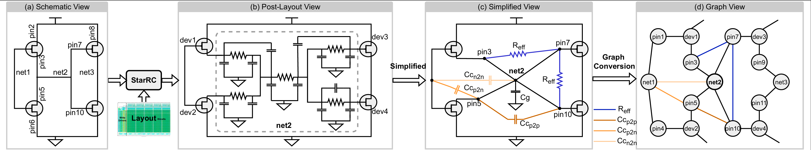


## 📁 Repository Structure

```
.
├── downstream_train.py      # Training script for downstream tasks
├── main.py                  # Main entry point for the training pipeline
├── model.py                 # GNN model architecture definitions
├── requirements.txt         # Python dependencies
├── sampling.py              # Graph sampling utilities
├── layer.py                 # Gnn+ model
├── gpslayer.py              # GPS attention
├── plot.py                  # Distribution maps of ground capacitance and coupling capacitance
├── sram_dataset.py          # Dataset loading and preprocessing
└── utils.py                 # Utility functions
```

## 💻 Installation

### Prerequisites

- Python 3.10+
- CUDA-compatible GPU (recommended)

### Setup Instructions

```bash
# Clone the repository
git clone https://github.com/stomlvforever/RCG.git

# Create and activate a conda environment
conda create -n RCG python=3.10
conda activate RCG

# Install dependencies
pip install -r requirements.txt
```

## 🚀 Usage

### Dataset Preparation

#### Dataset Download Instructions

The datasets used for training and testing RCG are available for download via the following links. You can use `curl` to directly download these files from the provided URLs.

##### List of Datasets

| Dataset Name    | Description                          | Download Link                                                                              |
| --------------- | ------------------------------------ | ------------------------------------------------------------------------------------------ |
| SSRAM           | Static Random Access Memory dataset  | [Download](https://circuitgcl-sram.s3.ap-southeast-2.amazonaws.com/raw/ssram.pt)           |
| DIGITAL_CLK_GEN | Digital Clock Generator dataset      | [Download](https://circuitgcl-sram.s3.ap-southeast-2.amazonaws.com/raw/digtime.pt)         |
| TIMING_CTRL     | Timing Control dataset               | [Download](https://circuitgcl-sram.s3.ap-southeast-2.amazonaws.com/raw/timing_ctrl.pt)     |
| ARRAY_128_32    | Array with dimensions 128x32 dataset | [Download](https://circuitgcl-sram.s3.ap-southeast-2.amazonaws.com/raw/array_128_32_8t.pt) |
| ULTRA8T         | Ultra 8 Transistor dataset           | [Download](https://circuitgcl-sram.s3.ap-southeast-2.amazonaws.com/raw/ultra8t.pt)         |
| SANDWICH-RAM    | Sandwich RAM dataset                 | [Download](https://circuitgcl-sram.s3.ap-southeast-2.amazonaws.com/raw/sandwich.pt)        |
| SP8192W         | Specialized 8192 Width dataset       | [Download](https://circuitgcl-sram.s3.ap-southeast-2.amazonaws.com/raw/sp8192w.pt)         |


##### Dataset Statistics

Below is a summary of the statistics for each dataset as used in our experiments:

|Split| Dataset   | Nodes         |               |        | Topological Edges |         | Labeled Edges          |               |               |          |
|-----------|-----------|---------------|---------------|--------|-------------------|---------|------------------------|---------------|---------------|----------|
||           | Net           | Device        | Pin    | Device-Pin        | Pin-Net | C<sub>p2n</sub>        | C<sub>p2p</sub> | C<sub>n2n</sub> | R<sub>eff</sub> |
| Train.&Val. |ssram     | 19.9K         | 57.4K         | 172.3K | 172.3K            | 134.1K  | 277.8K                 | 288.6K        | 58.5K         | 69.26K   |
| Test|digtime   | 1.05K         | 4.13K         | 12.4K  | 12.4K             | 5.77K   | 10.43K                 | 22.26K        | 0.94K         | 99.84K   |
| |timectrl  | 0.67K         | 4.38K         | 13.1K  | 13.1K             | 9.04K   | 15.1K                  | 17.4K         | 1.38K         | 99.99K   |
| |sarray    | 12.6K         | 32.8K         | 98.3K  | 98.3K             | 77.8K   | 158.9K                 | 176.6K        | 24.8K         | 99.71K   |
| |ultra     | 0.86M         | 2.33M         | 6.97M  | 6.97M             | 5.49M   | 12.14M                 | 14.22M        | 1.87M         | 0.83M    |
| |sandwich  | 1.15M         | 2.65M         | 7.94M  | 7.94M             | 6.24M   | 12.66M                 | 16.26M        | 2.33M         | 1.0M     |


#### Dataset Usage

Place your circuit datasets in the `./datasets/raw/` directory. The framework supports multiple SRAM circuit designs:

```
datasets/raw/
├── ssram.pt
├── digtime.pt
├── timing_ctrl.pt
├── array_128_32_8t.pt
├── ultar8t.pt
├── sandwich.pt
├── sp8192w.pt
└── ...
```

### Model Training

#### Basic Training

```bash
# For node classification task
python main.py --dataset ssram+digtime+timing_ctrl+array_128_32_8t --model gps_attention --task classification --task_level node --batch_size 128

# For edge regression task with GAI loss
python main.py --dataset ssram+digtime+timing_ctrl+array_128_32_8t --model gps_attention --task regression --task_level edge --batch_size 128
```


### Key Arguments

| Argument          | Description                          | Options                                                   |
| ----------------  | ------------------------------------ | --------------------------------------------------------- |
| `--task`          | Task type                            | `classification`, `regression`                            |
| `--task_level`    | Prediction level                     | `node`, `edge`                                            |
| `--dataset`       | Names of datasets (separated by `+`) | e.g., `ssram+digtime`                                     |
| `--model`         | GNN model architecture               | `gpsattention`                                            |
| `--local_gnn_type`| gnn<sup>+</sup> model                | `CustomGatedGCN`,`CustomGCNConv`,`CustomGINEConv`         |
| `--regress_loss`  | Regression loss function             | `mse`                                                     |
| `--class_loss`    | Classification loss function         |`cross_entropy`                                            |
| `--batch_size`    | Training batch size                  | Integer (default: `128`)                                  |

## 🧠 Framework Components
### Benchmark
Due to the wide distribution range of the capacitance, we limit the values to be processed within a certain range and normalize them to be distributed within the range of 0 to 1. The capacitance distribution range is as follows：
#### Edge Capacitance Distributions
<table>
  <tr>
    <td align="center"></td>
    <td align="center">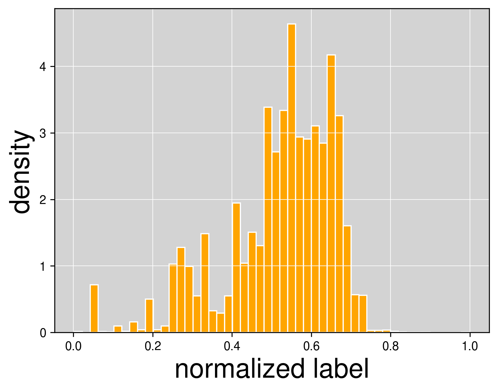</td>
    <td align="center">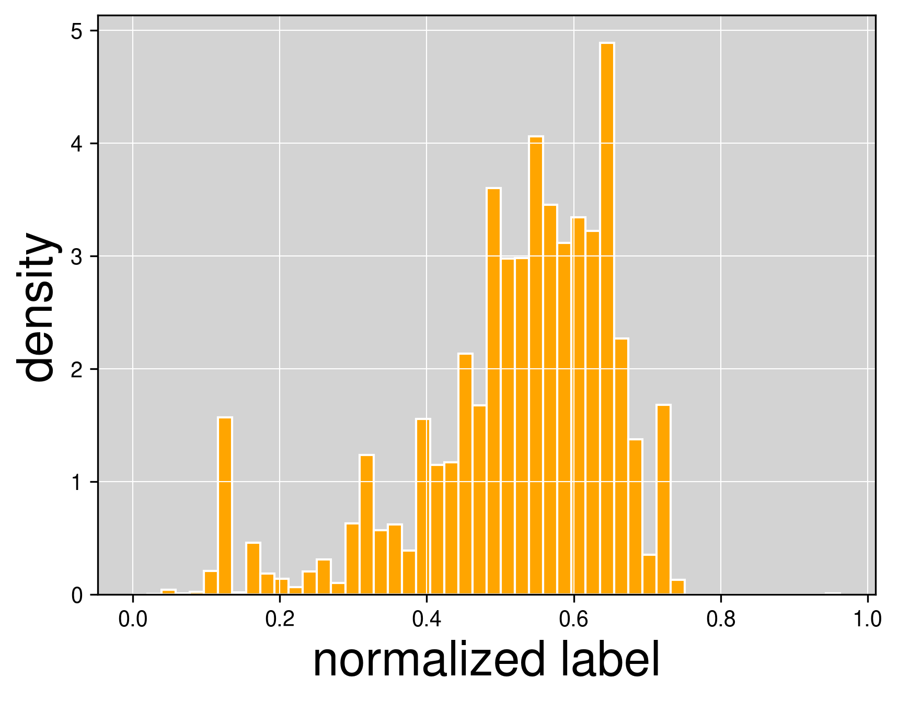</td>
    <td align="center">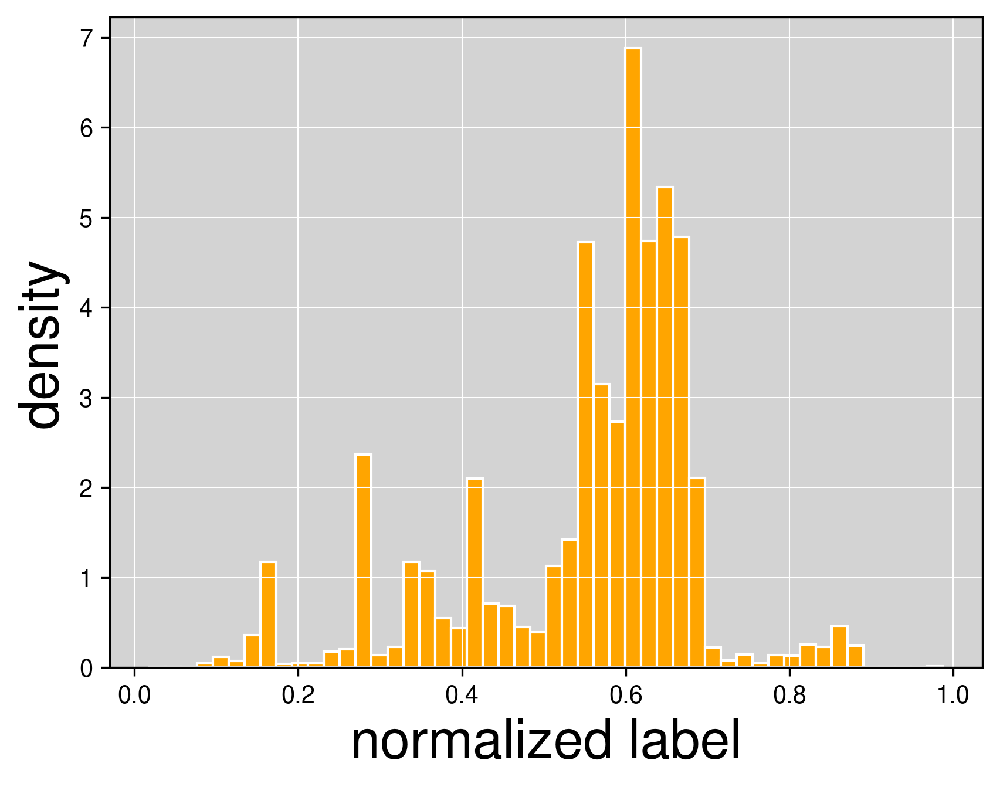</td>
    <td align="center">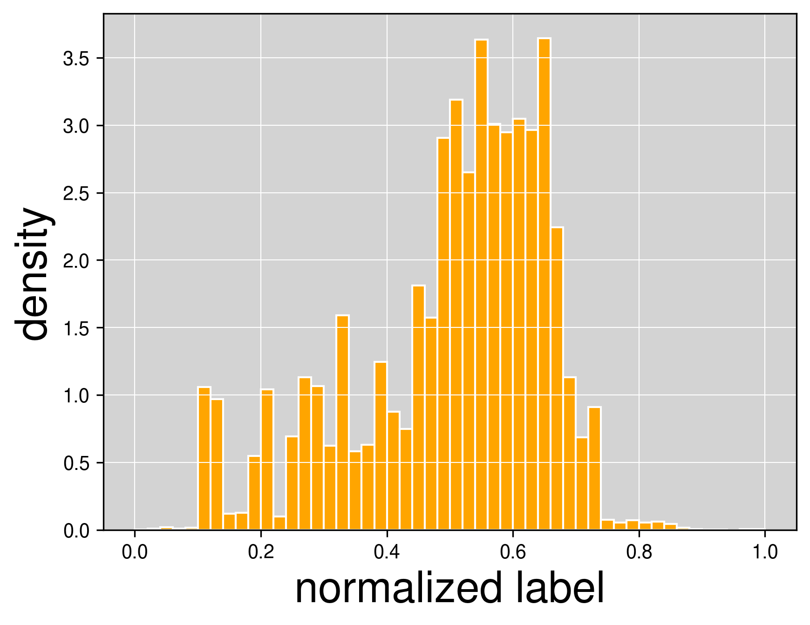</td>
    <td align="center">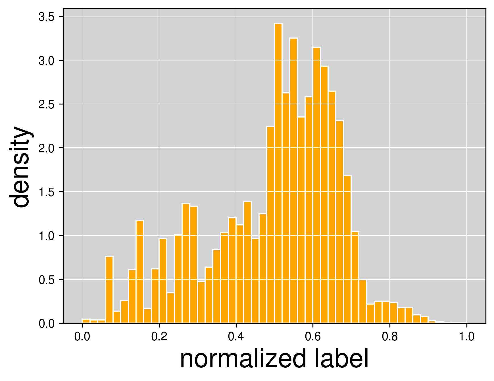</td>
  </tr>
  <tr>
    <td align="center">ssram</td>
    <td align="center">digtime</td>
    <td align="center">array_128_32_8t</td>
    <td align="center">timing_ctrl</td>
    <td align="center">ultra8t</td>
    <td align="center">sandwich</td>
</table>

#### Node Capacitance Distributions 
<table>
  <tr>
    <td align="center">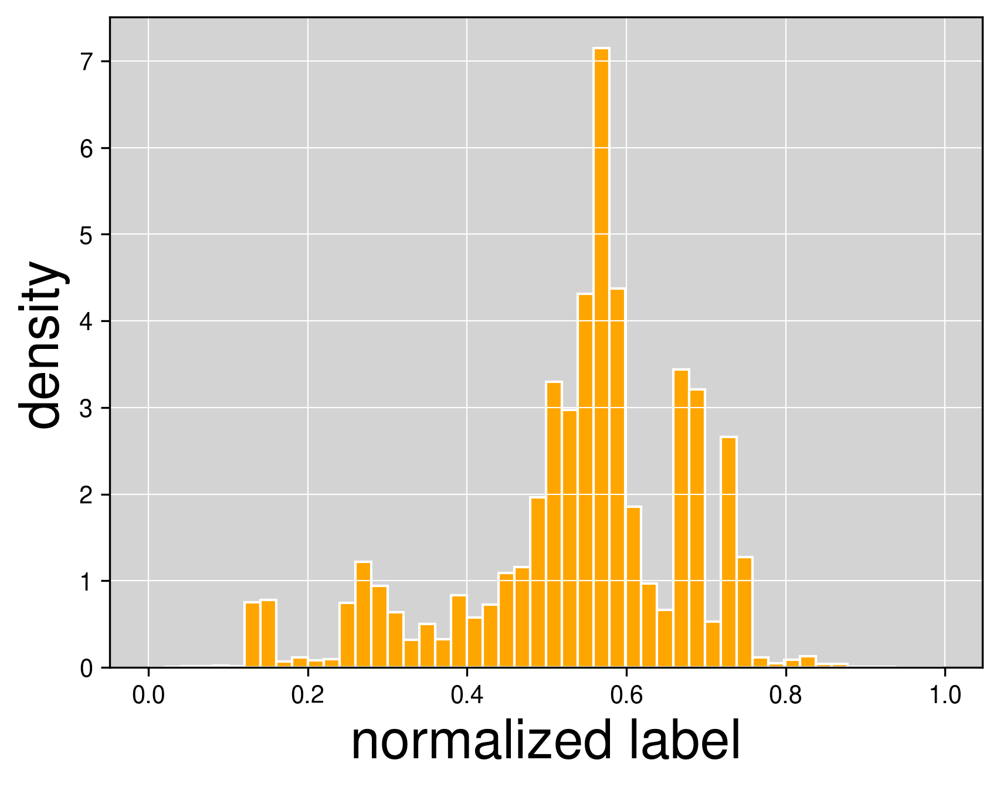</td>
    <td align="center">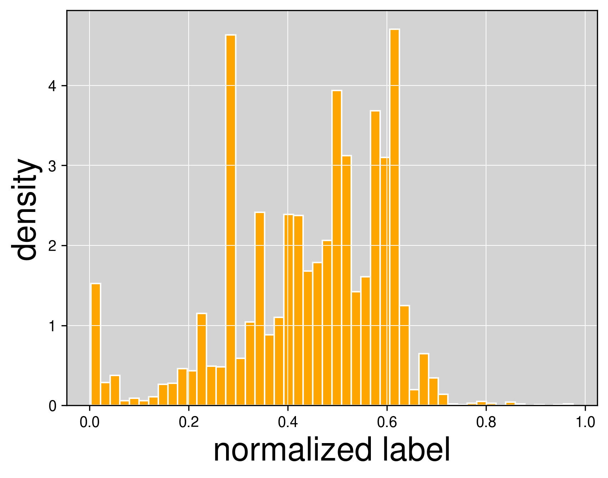</td>
    <td align="center">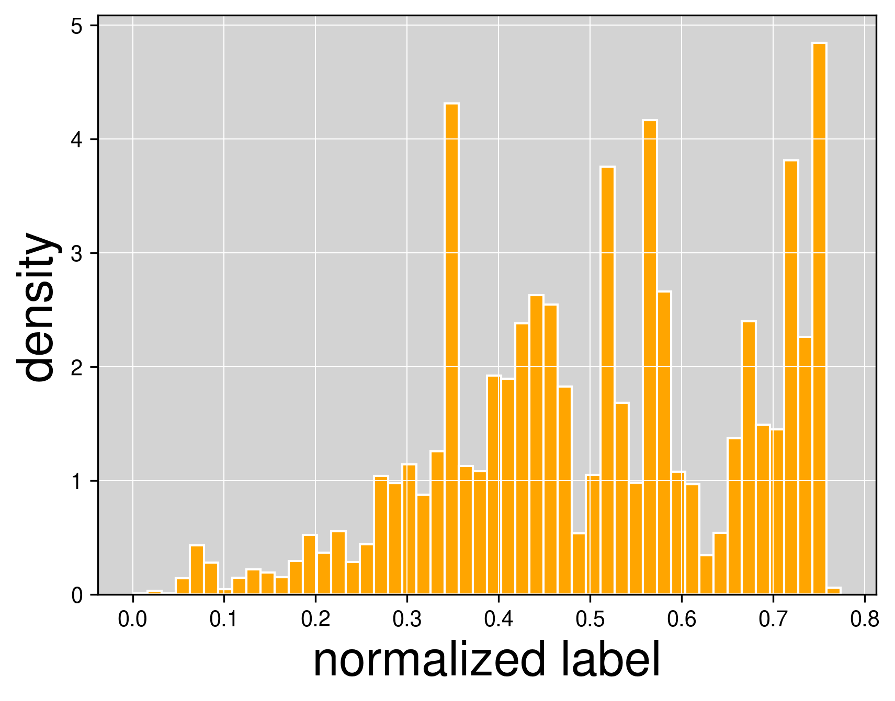</td>
    <td align="center">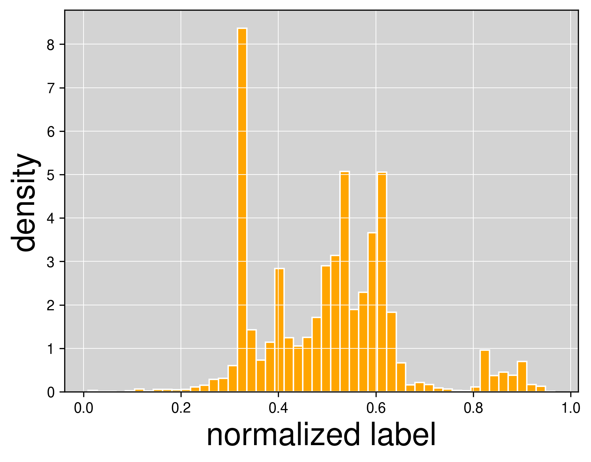</td>
    <td align="center">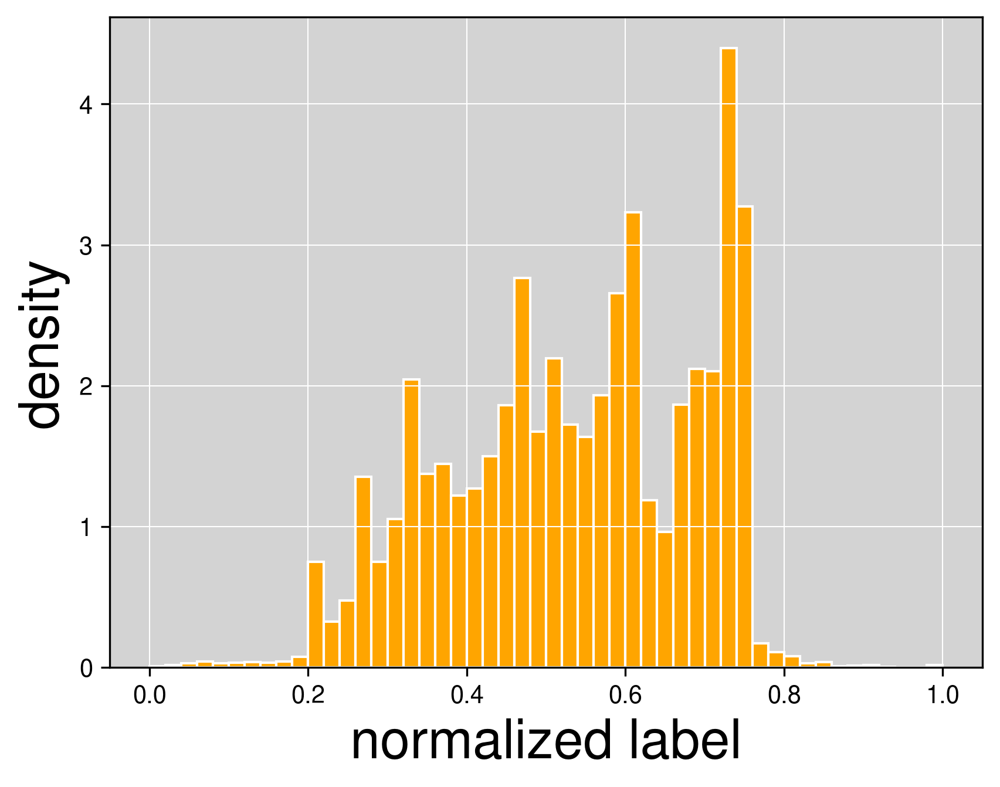</td>
    <td align="center">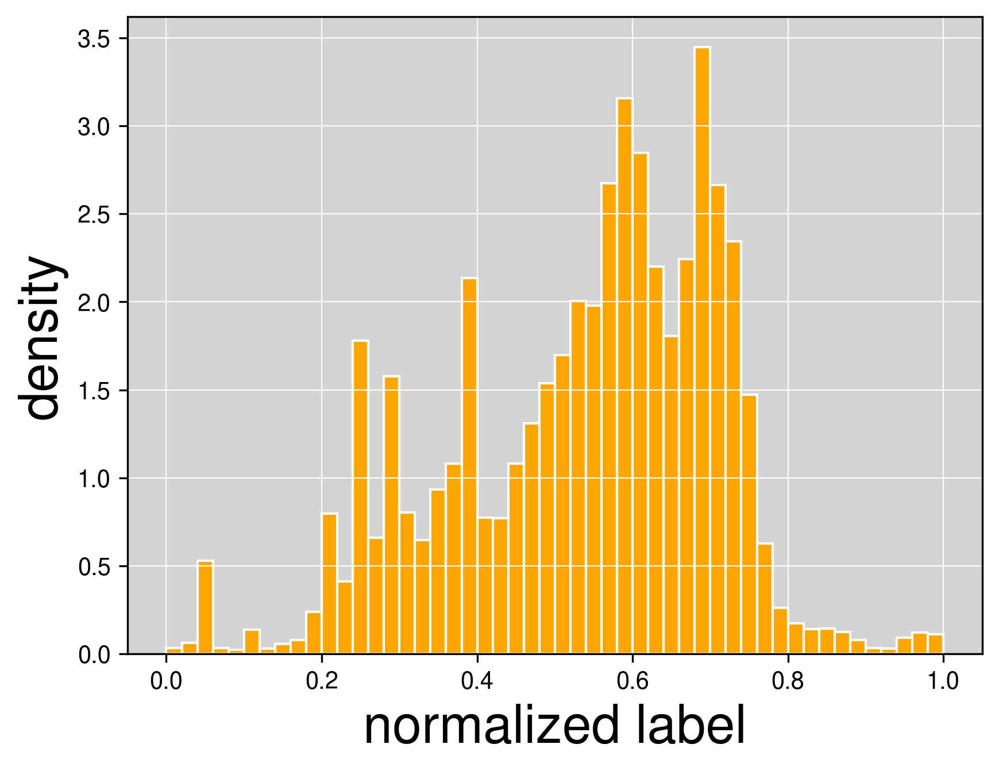</td>
  </tr>
  <tr>
    <td align="center">ssram</td>
    <td align="center">digtime</td>
    <td align="center">array_128_32_8t</td>
    <td align="center">timing_ctrl</td>
    <td align="center">ultra8t</td>
    <td align="center">sandwich</td>
</table>


### Gnn<sup>+</sup> model

GNN<sup>+</sup> is the strong baseline applied to the benchmarks, with the architecture illustrated as pictures:
<div align="center">
  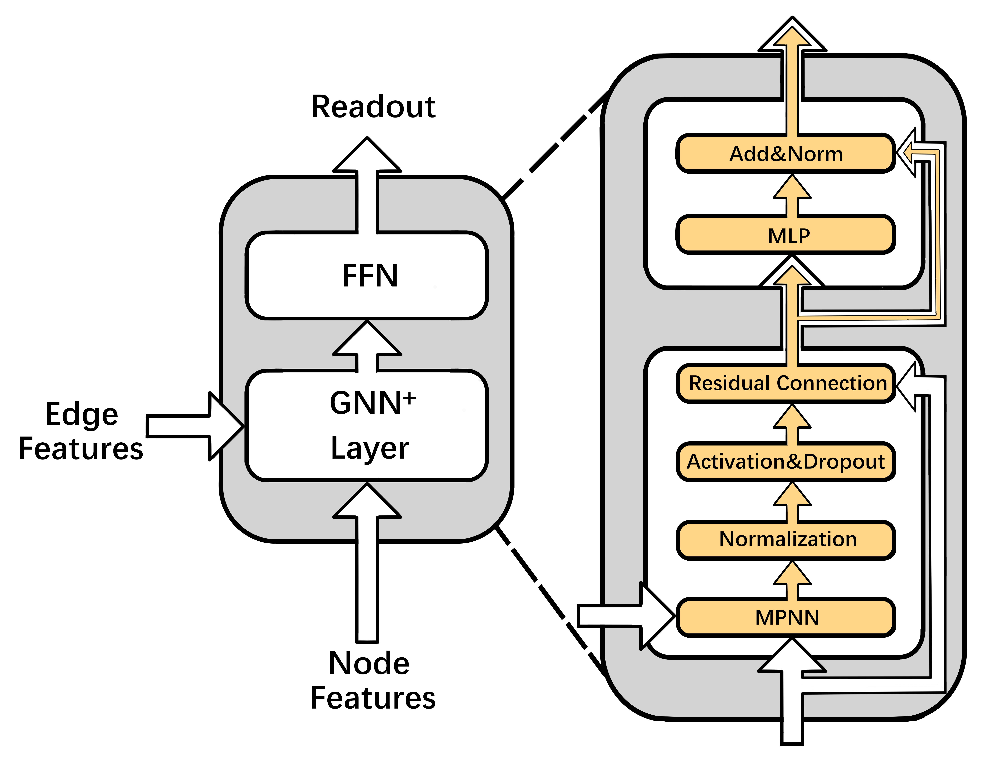
</div>

## 📊 Results

Our method demonstrates excellent performance in edge tasks and exhibits better robustness in handling some challenging datasets in node tasks.
The specific data is provided by the following table.

### Complete Performance Comparison Table
#### Node Task
##### Node Regression Performance Comparison across Different Datasets

| Dataset       | Train (MAE ↓) | Train (R² ↑) | digtime (MAE ↓) | digtime (R² ↑) | array (MAE ↓) | array (R² ↑) | ultra (MAE ↓) | ultra (R² ↑) | sandwich (MAE ↓) | sandwich (R² ↑) |
|---------------|---------------|--------------|-----------------|----------------|---------------|--------------|---------------|--------------|------------------|-----------------|
| **GCN<sup>+</sup>**      | 0.0391 (+4.8%) | 0.9233 (-1.1%) | **0.0828 (-32.5%)** | **0.5577 (+68.3%)** | **0.0992 (+8.5%)** | 0.6655 (-10.3%) | 0.1238 (-11.2%) | 0.6759 (+13.2%) | 0.1821 (-21.0%) | **0.5559 (+46.3%)** |
| **GCN**       | **0.0373** | **0.9344** | 0.1227 | 0.3313 | 0.0914 | **0.7423** | 0.1395 | 0.597 | 0.2306 | 0.3800 |
| **GatedGCN<sup>+</sup>** | 0.0457 (+4.3%) | 0.9075 (-1.5%) | 0.1089 (-62.4%) | 0.4629 (+129.7%) | 0.0978 (-55.4%) | 0.6562 (+109.1%) | 0.1184 (-11.6%) | 0.6889 (-3.3%) | 0.2532 (-42.0%) | 0.3056 (+124.7%) |
| **GatedGCN**  | 0.0438 | 0.9217 | 0.2896 | -1.5552 | 0.2194 | 0.3138 | 0.134 | **0.7127** | 0.4369 | -1.2375 |
| **GIN<sup>+</sup>**      | 0.0383 (+3.8%) | 0.9271 (-0.7%) | 0.0885 (-4.3%) | 0.5165 (+35.0%) | 0.1166 (-1.1%) | 0.7337 (+13.6%) | 0.1245 (+22.9%) | 0.6508 (-14.4%) | 0.2535 (+11.7%) | 0.2734 (+105.2%) |
| **GIN**       | 0.0369 | 0.933 | 0.0925 | 0.3825 | 0.1179 | 0.6459 | **0.1013** | 0.7604 | 0.2270 | -5.2274 |

##### Node Classification Performance Comparison across Different Datasets

| Model       | Train (Acc) | Train (F1) | timectrl (Acc) | timectrl (F1) | array (Acc) | array (F1) | ultra (Acc) | ultra (F1) | sandwich (Acc) | sandwich (F1) |
|-------------|------------|------------|----------------|---------------|------------|------------|-------------|------------|----------------|---------------|
| **GCN<sup>+</sup>**    | 0.7629 (-0.2%) | 0.6206 (-0.3%) | 0.6651 (-0.5%) | 0.4398 (+2.5%) | 0.7024 (-0.9%) | 0.4773 (-2.0%) | 0.7312 (+0.6%) | 0.4387 (-0.6%) | 0.7008 (-1.5%) | 0.4004 (-0.7%) |
| **GCN**     | **0.7643** | **0.6229** | 0.6683 | 0.4289 | 0.7088 | 0.4872 | 0.7269 | 0.4415 | 0.7119 | **0.4033** |
| **GatedGCN<sup>+</sup>** | **0.7674 (+0.6%)** | **0.6614 (+6.8%)** | 0.5566 (+97.3%) | 0.2221 (-11.1%) | 0.7153 (+54.4%) | 0.3786 (+0.0%) | 0.7285 (+0.8%) | 0.4397 (+0.4%) | **0.7279 (+4.1%)** | 0.3225 (-14.4%) |
| **GatedGCN** | 0.7632 | 0.6195 | 0.2821 | 0.2498 | 0.4634 | 0.3786 | 0.7227 | 0.4378 | 0.6994 | 0.3768 |
| **GIN<sup>+</sup>**    | 0.7623 (-0.02%) | 0.6268 (+1.1%) | 0.6937 (-6.8%) | 0.4155 (-8.3%) | 0.6603 (-8.5%) | 0.3758 (-24.6%) | **0.7325 (+65.0%)** | 0.4383 (-1.2%) | 0.7072 (-0.2%) | 0.3295 (-15.0%) |
| **GIN**     | 0.7625 | 0.6199 | **0.7445** | **0.4533** | **0.7218** | **0.4986** | 0.4439 | **0.4439** | 0.7088 | 0.3878 |

#### Edge Task
##### Edge Classification Performance Comparison across Different Datasets

| Model       | Train (Acc) | Train (F1) | digtime (Acc) | digtime (F1) | timectrl (Acc) | timectrl (F1) | ultra (Acc) | ultra (F1) | sandwich (Acc) | sandwich (F1) |
|-------------|------------|------------|--------------|--------------|---------------|---------------|-------------|------------|----------------|---------------|
| **GCN<sup>+</sup>**    | 0.7271 (-3.5%) | 0.6090 (-7.0%) | **0.6958 (+11.6%)** | 0.4618 (+8.2%) | **0.7048 (+19.4%)** | 0.5563 (+21.2%) | 0.7112 (-0.8%) | 0.5516 (-0.4%) | **0.6186 (+1.0%)** | 0.4355 (+1.0%) |
| **GCN**     | 0.7538 | 0.6547 | 0.6233 | 0.4268 | 0.5902 | 0.4587 | **0.7171** | 0.5540 | 0.6129 | 0.4314 |
| **GatedGCN<sup>+</sup>** | 0.7559 (-0.3%) | 0.6444 (-7.0%) | 0.6084 (+10.0%) | 0.4383 (+5.0%) | 0.6997 (+0.5%) | 0.5968 (-5.0%) | 0.6974 (+3.2%) | 0.5185 (-8.0%) | 0.5842 (+4.0%) | 0.3941 (-4.4%) |
| **GatedGCN** | 0.7580 | 0.6573 | 0.5532 | 0.4178 | 0.6961 | **0.6275** | 0.6759 | **0.5612** | 0.5614 | 0.4124 |
| **GIN<sup>+</sup>**    | 0.7512 (-2.4%) | 0.6383 (-5.1%) | 0.6269 (+3.2%) | **0.4715 (+18.8%)** | 0.6412 (+5.1%) | 0.4530 (+1.8%) | 0.6779 (-1.8%) | 0.4839 (-13.7%) | 0.5924 (+1.8%) | **0.4437 (+4.0%)** |
| **GIN**     | **0.7699** | **0.6726** | 0.6073 | 0.3969 | 0.6103 | 0.4452 | 0.6902 | 0.5609 | 0.5822 | 0.4269 |

##### Edge Regression Performance Comparison across Different Datasets

| Model       | Train (MAE) | Train (R²) | timectrl (MAE) | timectrl (R²) | array (MAE) | array (R²) | ultra (MAE) | ultra (R²) | sandwich (MAE) | sandwich (R²) |
|-------------|------------|------------|---------------|---------------|------------|------------|-------------|------------|----------------|---------------|
| **GCN<sup>+</sup>**    | 0.0667 (+3.9%) | 0.5871 (-4.4%) | 0.0728 (+1.0%) | **0.6974 (+2.0%)** | **0.0668 (-15.7%)** | **0.5434 (+24.3%)** | 0.0797 (-1.5%) | 0.4305 (+1.8%) | 0.0965 (-3.2%) | 0.4453 (+7.5%) |
| **GCN**     | 0.0642 | 0.6144 | 0.0721 | 0.6837 | 0.0792 | 0.4371 | 0.0810 | 0.4228 | 0.0997 | 0.4138 |
| **GatedGCN<sup>+</sup>** | **0.0601 (+5.3%)** | 0.6368 (-4.2%) | 0.0682 (-8.9%) | 0.6772 (+10.1%) | 0.0808 (-2.6%) | 0.4037 (+32.8%) | 0.0808 (-0.4%) | 0.3880 (-3.6%) | 0.0976 (-0.3%) | 0.4220 (+0.3%) |
| **GatedGCN** | 0.0571 | **0.6650** | 0.0749 | 0.6148 | 0.0830 | 0.3039 | 0.0811 | 0.4027 | 0.0979 | 0.4208 |
| **GIN<sup>+</sup>**    | 0.0571 (-2.4%) | 0.6558 (+1.0%) | **0.0681 (-2.0%)** | 0.6882 (+1.1%) | 0.0861 (-5.3%) | 0.3800 (+16.8%) | **0.0779 (-0.8%)** | **0.4421 (+5.2%)** | 0.0990 (+2.0%) | 0.4215 (-1.6%) |
| **GIN**     | 0.0585 | 0.6493 | 0.0695 | 0.6806 | 0.0909 | 0.3253 | 0.0785 | 0.4204 | **0.0970** | **0.4285** |

## 🚀 RCG Circuit Graph Analysis API
A service based on FastAPI, which encapsulates the RCG graph neural network pipeline. This service provides endpoint functions such as creating/loading datasets, segmenting and extracting data, starting and monitoring training, evaluating prediction results, 和 visualizing label distribution. It also supports four types of tasks: node regression and classification, edge regression and classification.

### Plan One
If you wish to use it, please follow the instructions below to operate.
```bash
# Start the API
python api.py 
```
Then you can open another terminal window.
```bash
Available dataset_name: `sandwich`, `ultra8t`, `ssram`, `sp8192w`, `digtime`, `timing_ctrl`, `array_128_32_8t`
task_level: `edge`，`node`
task: `edgeclass`，`nodeclass`，`edgeregress`， `noderegress`
```

```bash
# create “ssram” for node classification
curl -X POST "http://localhost:8000/api/dataset/create" -H "Content-Type: application/json" -d '{"name":"ssram","task":"nodeclass"}'
# get split indices for nodeclass
curl -X POST "http://localhost:8000/api/dataset/split" -H "Content-Type: application/json" -d '{"name":"ssram","task":"nodeclass"}'
# get train DataLoader for edge classification
curl -X POST "http://localhost:8000/api/dataset/dataloader?split_type=train" -H "Content-Type: application/json" -d '{"name":"ssram","task":"nodeclass"}'
# start training nodeclass on ssram
curl -X POST "http://localhost:8000/api/train" -H "Content-Type: application/json" -d '{"dataset_name":"ssram","task":"nodeclass","task_level":"node","epochs":10,"batch_size":128,"lr":0.0001,"model":"gps_attention","num_gnn_layers":4,"num_head_layers":2,"hid_dim":144,"dropout":0.3,"act_fn":"prelu","global_model_type":"None","local_gnn_type":"CustomGatedGCN","num_heads":2,"attn_dropout":0.7,"gpu":1,"seed":42,"use_stats":1,"net_only":0,"neg_edge_ratio":0.5}' 
# check status of task ——
curl -X GET "http://localhost:8000/api/tasks/task_id"
# visualize edge label buckets
curl -X POST "http://localhost:8000/api/visualize" -H "Content-Type: application/json" -d '{"dataset_name":"ssram","task_level":"edge","class_boundaries":[0.2,0.4,0.6,0.8]}'
# list all supported datasets
curl -X GET "http://localhost:8000/api/datasets" 
```

### Plan Two
Or you can choose the following way to run our API
```bash
import torch
import asyncio
from api import PyGraphDataset, Evaluator
from api import create_visualization, VisualizationRequest

# 1. Load the “ssram” dataset for node‐classification
dataset = PyGraphDataset(name="ssram", task="nodeclass")

# 2. Split into train/valid/test (60/20/20)
splits = dataset.get_idx_split()
train_idx = splits["train"]
valid_idx = splits["valid"]
test_idx  = splits["test"]

# 3. Build PyG DataLoaders for each split
train_loader = dataset.get_dataloader(train_idx)
valid_loader = dataset.get_dataloader(valid_idx)
test_loader  = dataset.get_dataloader(test_idx)

# 4. After training, evaluate on your test split:
#    Suppose you collected y_true/y_pred from your trained model:
#    (e.g. iterate test_loader, run model(batch) → preds, batch.y[:,1] → labels)
y_true = [0,1,1,0,2,1]   # ← replace with your actual test labels
y_pred = [0,1,0,0,2,1]   # ← replace with your model’s predictions

evaluator = Evaluator(name="ssram", task="nodeclass")
metrics   = evaluator.eval({"y_true": y_true, "y_pred": y_pred})
print("Evaluation results:", metrics)

# 5. Visualize node‐label distribution
async def main():
    # 构造一个可视化请求
    req = VisualizationRequest(
        dataset_name="ssram",
        task_level="node",              # or "edge"
        class_boundaries=[0.2,0.4,0.6,0.8]
    )
    # 调用 FastAPI 里定义的 create_visualization 函数
    res = await create_visualization(req)
    return res

if __name__ == "__main__":
    result = asyncio.run(main())
    print("Visualization metadata:", result)
    print("Image saved at:", result["visualization_path"])

```

## 📄 License

This project is licensed under the MIT License - see the LICENSE file for details.
